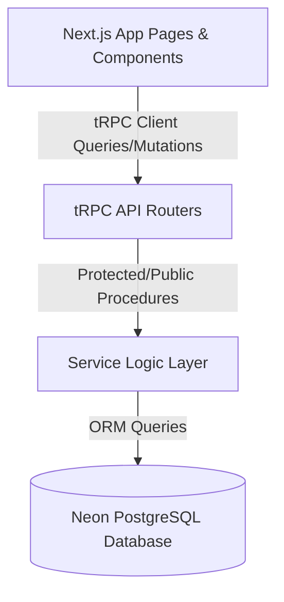

# TransitOps Fleet & Driver Management Context

This document outlines the architecture, database schemas, validation layer, services, tRPC routers, and frontend UI components implemented for the TransitOps Fleet Operations Platform.

---

## 🏛️ Application Architecture

TransitOps is built using **Next.js 16 (App Router)**, **tRPC** for type-safe API communication, **Prisma** as the ORM, **PostgreSQL** (Neon) as the database, and **Base UI / Tailwind CSS** for a premium, accessible UI design.

---

## 🗄️ Database Schema & Models

The following models are defined in [schema.prisma](file:///Users/adi/Documents/Odoo-Project/transitops/prisma/schema.prisma):

### 1. `User`
- Handles user identity, roles (`ADMIN`, `FLEET_MANAGER`, etc.), and NextAuth JWT credentials.

### 2. `Vehicle`
- **Fields**: `id`, `registrationNumber` (Unique), `name`, `type`, `maxLoadCapacity`, `odometer`, `acquisitionCost`, `status` (`AVAILABLE`, `ON_TRIP`, `IN_SHOP`, `RETIRED`).

### 3. `Driver`
- **Fields**: `id`, `name`, `licenseNumber` (Unique), `licenseCategory`, `licenseExpiry`, `phone`, `safetyScore` (0-100), `status` (`AVAILABLE`, `ON_TRIP`, `OFF_DUTY`, `SUSPENDED`).

---

## 🛡️ Validation Layer (Zod)

- **Vehicles**: Configured in [vehicle.ts](file:///Users/adi/Documents/Odoo-Project/transitops/src/lib/validations/vehicle.ts) enabling input coercion.
- **Drivers**: Configured in [driver.ts](file:///Users/adi/Documents/Odoo-Project/transitops/src/lib/validations/driver.ts) with license expiry date validation.

---

## ⚙️ Service Layer & Business Rules

### Vehicles Service: [vehicle.service.ts](file:///Users/adi/Documents/Odoo-Project/transitops/src/server/services/vehicle.service.ts)
- Checks for unique registration number before creation and updates.
- Blocks deleting a vehicle if its status is `ON_TRIP`.

### Drivers Service: [driver.service.ts](file:///Users/adi/Documents/Odoo-Project/transitops/src/server/services/driver.service.ts)
- Checks for unique license number before creation and updates.
- Throws `"License expired"` if the license expiry date is in the past.
- Blocks deleting a driver if their status is `ON_TRIP`.

---

## ⚡ API Procedures (tRPC)

All router layers are registered under the central root router in [root.ts](file:///Users/adi/Documents/Odoo-Project/transitops/src/server/api/root.ts):
- **Public**: `create`, `list`/`getAll`, `get`/`getById`
- **Protected (Authorized)**: `update`, `delete` (requires NextAuth session validation in [trpc.ts](file:///Users/adi/Documents/Odoo-Project/transitops/src/server/api/trpc.ts))

---

## 🎨 Frontend UI Components

Located at `/dashboard` in [page.tsx](file:///Users/adi/Documents/Odoo-Project/transitops/src/app/dashboard/page.tsx):

### 1. Header & Tabs Toggle
- Displays a segment selector to toggle between the **Vehicles** and **Drivers** panel views.

### 2. Metrics Cards
- Displays 4 real-time counts at the top of the dashboard.
- Displays counts for total, available, on-trip, and suspended/in-shop assets depending on the active tab context.

### 3. Forms Modal Integration
- Houses [VehicleForm.tsx](file:///Users/adi/Documents/Odoo-Project/transitops/src/components/VehicleForm.tsx) and [DriverForm.tsx](file:///Users/adi/Documents/Odoo-Project/transitops/src/components/DriverForm.tsx) within overlay dialogs for clean creation and updates.
- Pre-formats Date values into standard HTML date inputs.
- Emits Toast notifications on successes or errors.

### 4. Tables with Live Filters
- Instantly searches by registration/name and filters by status or category.
- Formats dropdown triggers to show `Type: All`, `Category: All`, and `Status: All`.
- Displays `🔴 Expired` and `🟢 Valid` indicator badges for licenses.
